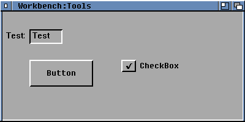

# Amiga-Window

Amiga-Fenster für Windows und PureBasic

## Benutzung

- [.zip](https://github.com/Chregu73/Amiga-Window/archive/refs/heads/main.zip) herunterladen
- `.zip` entpacken
- [Amiga-Window.exe](Amiga-Window.exe) starten

Optional:

- `AMIGA.FON` (Font) [installieren](#anleitung-zur-installation-eines-fon-fonts)
- Mauszeiger (`.cur`) [installieren](#anleitung-zur-installation-einer-cur-datei)
- `Amiga-Window.pb` in PureBasic laden und experimentieren

## Was schon funktioniert

- Grösse im Quellcode einstellbar
- Fenster über Klick schliessbar
- mit der Titelleiste ziehbar
- Minimieren
- Farbe ändert wenn aktiv/inaktiv
- ein paar Gadgets

## Was noch nicht funktioniert

- Grösse ändern
- Gadgets hinzufügen
- Fenster ziehen im CallBack

---

# Anleitung zur Installation eines .fon-Fonts

`.fon`-Dateien sind ein älteres, aber immer noch unterstütztes Format für Windows-Schriftarten. Sie können einfach auf zwei Arten installiert werden.

### Methode 1: Über das Kontextmenü installieren

Dies ist der einfachste Weg, einen einzelnen Font zu installieren.

1.  Navigiere im **Datei-Explorer** zu der `.fon`-Datei.
2.  Klicke mit der **rechten Maustaste** auf die Datei.
3.  Wähle im Kontextmenü **Installieren** aus.
4.  Ein kleines Fenster wird kurz angezeigt, und der Font wird automatisch installiert.

### Methode 2: Manuelle Installation

Diese Methode ist nützlich, wenn du mehrere Fonts gleichzeitig installieren möchtest oder falls die erste Methode nicht funktioniert.

1.  Öffne den **Windows-Schriftartenordner**. Drücke dazu die `Windows-Taste` + `R`, gib `fonts` ein und drücke **Enter**.
2.  Ein Fenster mit all deinen installierten Schriftarten öffnet sich. 
3.  Ziehe die `.fon`-Datei einfach per **Drag-and-Drop** in dieses Fenster.
4.  Windows erkennt die Datei und installiert den Font automatisch.

---

# Anleitung zur Installation einer .cur-Datei

### 1. Cursor-Datei kopieren

Zuerst musst du die `.cur`-Datei in das offizielle Windows-Cursor-Verzeichnis verschieben, damit das Betriebssystem sie finden kann.

* Öffne den **Ausführen**-Dialog, indem du die `Windows-Taste` + `R` drückst.
* Gib `%windir%\cursors` ein und drücke `Enter`.
* Kopiere deine `.cur`-Datei in diesen Ordner. Möglicherweise benötigst du Administratorrechte, um die Datei einzufügen.

### 2. Cursor in den Mauseinstellungen aktivieren

Nachdem die Datei im richtigen Ordner ist, kannst du sie in den Windows-Mauseinstellungen auswählen.

* Öffne die **Systemsteuerung** und gib in die Suchleiste `Maus` ein. Klicke auf das Ergebnis.
* Im Fenster **"Eigenschaften von Maus"** wechsele zur Registerkarte **"Zeiger"**.
* Wähle in der Liste den Cursor-Typ aus, den du ersetzen möchtest (z. B. "Standardauswahl").
* Klicke auf **"Durchsuchen..."**, wähle deine `.cur`-Datei aus dem `cursors`-Ordner aus und klicke auf **"Öffnen"**. 
* Bestätige die Änderungen mit **"Übernehmen"** und **"OK"**.

Dein neuer Cursor sollte nun aktiv sein. Du kannst diese Schritte für andere Cursor-Typen wiederholen, um ein komplettes Cursor-Set zu installieren.
